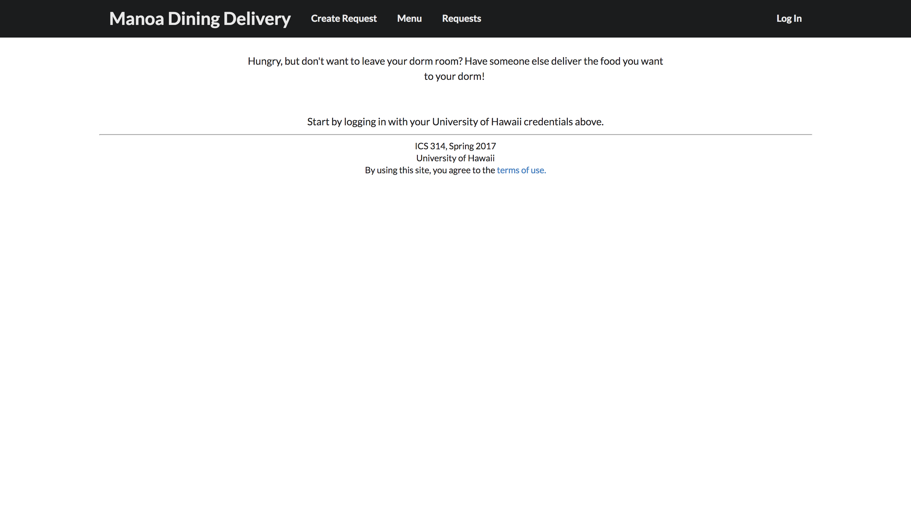

# About Manoa Dining Delivery

Manoa Dining Delivery is a Meteor application that allows University of Hawaii
at Manoa students to create requests to have food delivered right to their
dorms. The foods come from the two cafeterias on campus: Hale Aloha Café and
Gateway Café. Eventually, these requirements should be fulfilled in order to 
create a working application:

* Create a form that allows students to request foods from the two cafeterias on
campus
* Develop a page showing all requests that can be fulfilled
* Create a menu page to display the foods currently on the menu at each of the
cafeterias
* Utilize the University of Hawaii CAS authentication system to allow students
to log in and use the application

# Pages

The following pages are a baseline of what the application will look like. The 
pages are subject to change as development progresses.

## Landing Page

Upon entering the site, the user is directed to the landing page.

## Terms of Use Page

In order to use the application, users must agree to the terms of use, displayed
on the following page.

## Log In Page

This page is used to allow users to login and use the application. Eventually,
this will be change to utilize the UH CAS authentication system rather than this
to allow users to log in.

## Create a Request Page

Users can create a request to have food delivered to their dorm using the
following form. It requires the user enter their dorm, room number, and the
foods they want delivered.

## Requests Page

All requests that are made are displayed on the following page. Other users
can choose to accept the request and fulfill it.

## Menu Page

The current foods on the menu at both cafeterias will be displayed on this page.
A script will be used to retrieve them.

