# Table of Contents

* [About Manoa Dining Delivery](#about-manoa-dining-delivery)
  * [Background](#background)
  * [Problem](#problem)
  * [Solution](#solution)
* [Installation Guide](#installation-guide)
* [Application Design](#application-design)
  * [Directory Structure](#directory-structure)
  * [Import Conventions](#import-conventions)
  * [Naming Conventions](#naming-conventions)
  * [Data Model](#data-model)
  * [CSS](#css)
  * [Routing](#routing)
  * [Authentication](#authentication)
  * [Authorization](#authorization)
  * [Configuration](#configuration)
  * [Quality Assurance](#quality-assurance)
    * [ESLint](#eslint)
* [Development History](#development-history)
  * [Milestone 1: Mockup Development](#milestone-1-mockup-development)
  * [Milestone 2: Collections and Design](#milestone-2-collections-and-design)
  * [Milestone 3](#milestone-3)

# About Manoa Dining Delivery

The current version of the Manoa Dining Delivery application can be found 
[here](http://manoa-dining-delivery.meteorapp.com/).

When you arrive to the site, you are greeted by the following landing page:

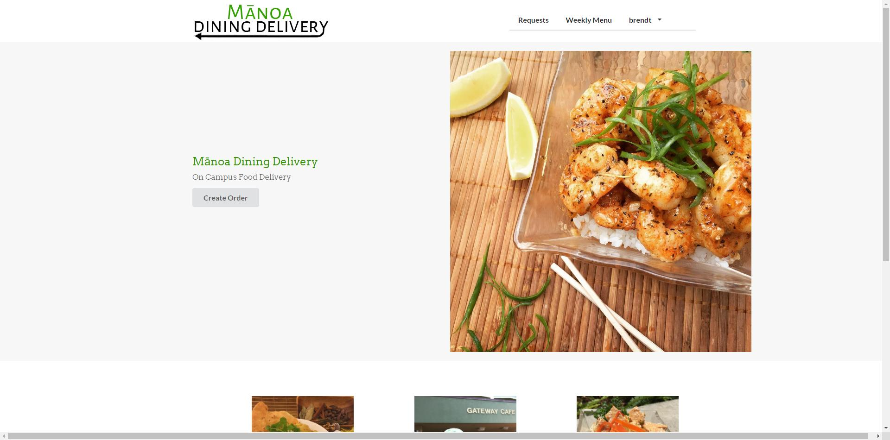

Anyone with a UH account can login to Manoa Dining Delivery by clicking on the login button. The UH CAS authentication screen then appears and requests your UH account and password. Upon logging in you are able to create a food delivery request and view all food delivery requests:

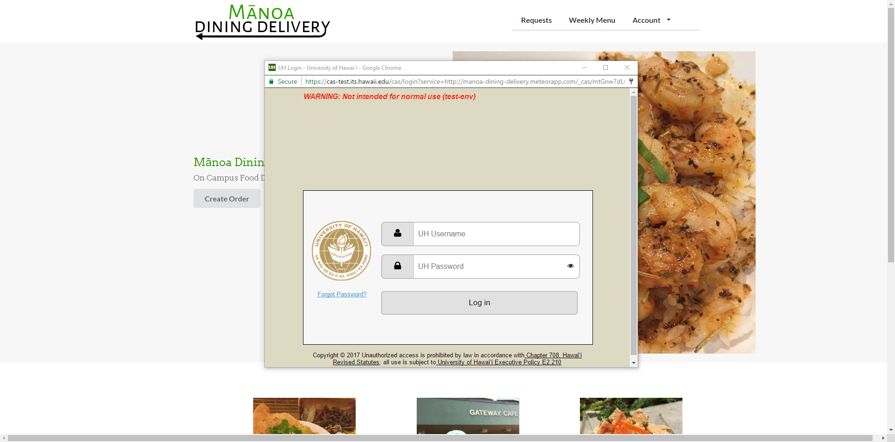

Once authenticated, you can edit your profile corresponding to which dorm you're in and what your room number is: 

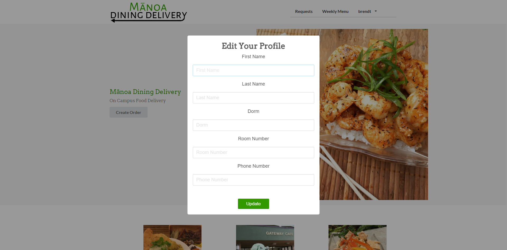

Users can request a delivery by filling out the following form:

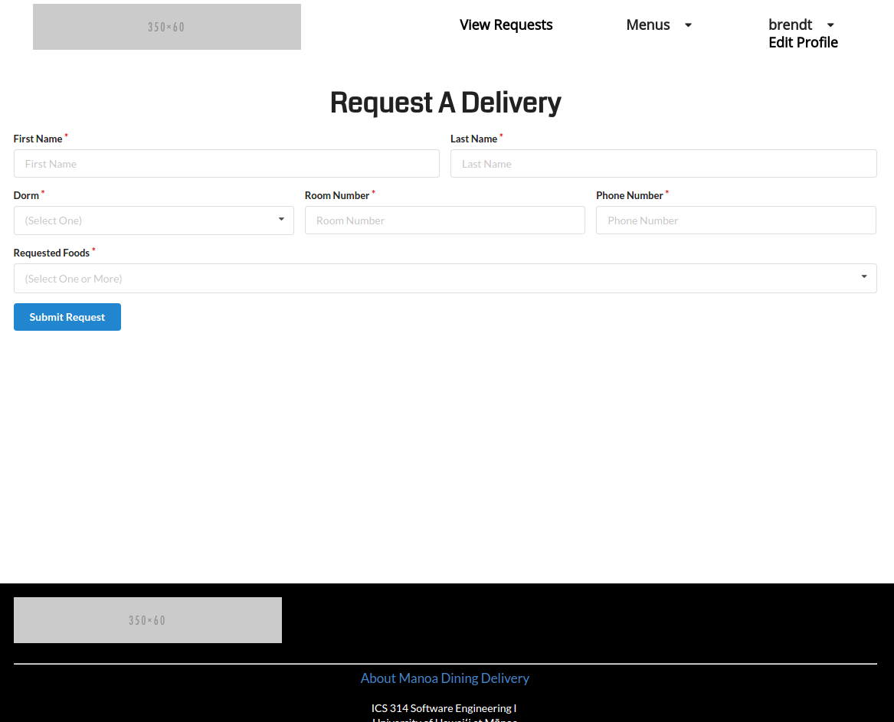

Upon filling out the form, their request will appear in the page below. Other
users can choose to fulfill that request.

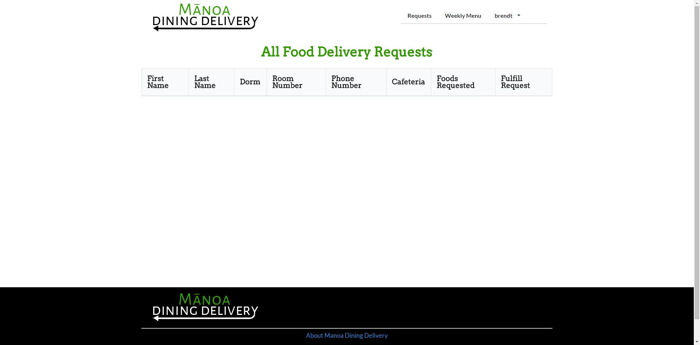

Before making their decision to order food from the cafe, students can view the menu, sorted by day and time, of what cafe they want to order from! The menu is scripted using python python and automatically updates each week!

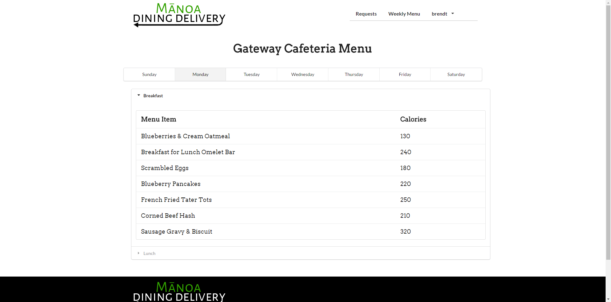

## Background

Meal plans at the University of Hawaii at Manoa come in either 7, 10, 14 or 19
meals a week along with  "meal points", which are essentially cash credits put 
in your account (1 point = $1) that are reloaded once a semester. For students
living at the dormitories, it is mandatory to have a meal plan.

## Problem

Meals do not rollover to the next week if you do not spend them all. Meal
points, however, do rollover to the next semester if you do not spend it all.
By the end of each week, many people have tons of meals left over and are forced
to spend their meals at The Market, an on-campus convenience store, on food they
don't really want. If given the opportunity, many of those people would exchange
their meals for cash.

In addition, many people who are busy studying (or being lazy) would rather have
food delivered to them rather than going all the way to the cafeteria to get
food. If given the opportunity to get food delivered to them for a small amount,
some students would do so.


## Solution

Manoa Dining Delivery is a Meteor application that allows University of Hawaii
at Manoa students to create requests to have food delivered right to their
dorms. The foods come from the two cafeterias on campus: Hale Aloha Café and
Gateway Café. Students living at the dorms will be able to spend their meals
in exchange for cash.

# Installation Guide

First, [install Meteor](https://www.meteor.com/install).

Second, clone the application by invoking the following command 
on the terminal.

```
$ git clone https://github.com/innovation-manoa/manoa-dining-delivery.git
```

Alternatively, you can download it by clicking [here](https://github.com/innovation-manoa/manoa-dining-delivery/archive/master.zip).

Third, cd into the app/ directory and install required packages using:

```
$ meteor npm install
```

Fourth, run the system with:

```
$ meteor npm run start
```

When the application is successfully built, it will appear on [http://localhost:3000/](http://localhost:3000/).

# Application Design

## Directory structure

The top-level directory structure contains:

```
app/        # holds the Meteor application source code
config/     # holds configuration files, such as settings.development.json
.gitignore  # ignores IntelliJ files, the settings file, and node_modules folder
```

This structure separates configuration files (such as the settings files) in the config/ directory from the actual Meteor application in the app/ directory.

The app/ directory has this top-level structure:

```
client/
  lib/           # holds Semantic UI files.
  head.html      # the <head>
  main.js        # import all the client-side HTML and JS files. 

imports/
  api/           # Defines the various data models for the application
    profiles/
    requests/
  startup/       # Define code to run when system starts up (client-only, server-only)
    client/        
    server/        
  ui/
    components/  # Contains templates for form fields
    layouts/     # Layouts contain common elements to all pages (i.e. menubar and footer)
    pages/       # Pages are navigated to by FlowRouter routes.
    stylesheets/ # CSS customizations, if any.

node_modules/    # managed by Meteor

private/         # holds the JSON files used to implement the menu

public/          
  images/        # holds static images for landing page and predefined sample users.
  
server/
   main.js       # import all the server-side js files.
```

## Import conventions

This system adheres to the Meteor 1.4 guideline of putting all application code in the imports/ directory, and using client/main.js and server/main.js to import the code appropriate for the client and server in an appropriate order.

This system accomplishes client and server-side importing in a different manner than most Meteor sample applications. In this system, every imports/ subdirectory containing any Javascript or HTML files has a top-level index.js file that is responsible for importing all files in its associated directory.   

Then, client/main.js and server/main.js are responsible for importing all the directories containing code they need. For example, here is the contents of client/main.js:

```
import '/imports/startup/client';
import '/imports/startup/both';
import '/imports/ui/layouts';
import '/imports/ui/pages';
import '/imports/ui/stylesheets/style.css';
import '/imports/ui/components/form-controls/';
```

Apart from the line that imports style.css directly, the other lines all invoke the index.js file in the specified directory.

We use this approach to make it more simple to understand what code is loaded and in what order, and to simplify debugging when some code or templates do not appear to be loaded.  In our approach, there are only two places to look for top-level imports: the main.js files in client/ and server/, and the index.js files in import subdirectories. 

Note that this two-level import structure ensures that all code and templates are loaded, but does not ensure that the symbols needed in a given file are accessible.  So, for example, a symbol bound to a collection still needs to be imported into any file that references it. 
 
## Naming conventions

This system adopts the following naming conventions:

  * Files and directories are named in all lowercase, with words separated by hyphens. Example: accounts-config.js
  * "Global" Javascript variables (such as collections) are capitalized. Example: Profiles.
  * Other Javascript variables are camel-case. Example: collectionList.
  * Templates representing pages are capitalized, with words separated by underscores. Example: Profile_Page. The files for this template are lower case, with hyphens rather than underscore. Example: profile-page.html, profile-page.js.
  * Routes to pages are named the same as their corresponding page. Example: 
  Profile_Page.

## Data model

The data model uses the [aldeed:simple-schema](https://github.com/aldeed/meteor-simple-schema)
package, a MongoDB-based schema. The schema is then attached to a MongoDB
collection to utilize the `CRUD` operations.

## CSS

The application uses the [Semantic UI](http://semantic-ui.com/) CSS framework. To learn more about the Semantic UI theme integration with Meteor, see [Semantic-UI-Meteor](https://github.com/Semantic-Org/Semantic-UI-Meteor).

The Semantic UI theme files are located in [app/client/lib/semantic-ui](https://github.com/innovation-manoa/manoa-dining-delivery/tree/master/app/client/lib/semantic-ui) directory. Because they are located in the client/ directory and not the imports/ directory, they do not need to be explicitly imported to be loaded. (Meteor automatically loads all files into the client that are located in the client/ directory). 

Note that the user pages contain a menu fixed to the top of the page, and thus the body element needs to have padding attached to it.

## Routing

For display and navigation among its four pages, the application uses [Flow Router](https://github.com/kadirahq/flow-router).

Routing is defined in [imports/startup/client/router.js](https://github.com/innovation-manoa/manoa-dining-delivery/blob/master/app/imports/startup/client/router.js).

Manoa Dining Delivery defines the following routes:

  * The `/` route goes to the public landing page.
  * The `/profile/<user>` route goes the profile page associated with `user`, which is the UH account name.
  * The `/view_all` route goes to a page displaying all requests that can be fulfilled.
  * The `/add_request` route goes to a page that allows users to create requests
  * The `/hale_aloha_menu` and `/gateway_menu` routes go to pages displaying each cafeteria's menu for the week.

## Authentication

For authentication, the application uses the University of Hawaii CAS test server, and follows the approach shown in [meteor-example-uh-cas](http://ics-software-engineering.github.io/meteor-example-uh-cas/).

When the application is run, the CAS configuration information must be present in a configuration file such as [config/settings.development.json](https://github.com/ics-software-engineering/meteor-application-template/blob/master/config/settings.development.json). 

Anyone with a UH account will be able to log in and use the application.

## Authorization

The landing and directory pages are public; anyone can access those pages.

The profile and filter pages require authorization: you must be logged in (i.e. authenticated) through the UH test CAS server, and the authenticated username returned by CAS must match the username specified in the URL.  So, for example, only the authenticated user `jdoe` can access the page `http://localhost:3000/profile/jdoe`.

To prevent people from accessing pages they are not authorized to visit, template-based authorization is used following the recommendations in [Implementing Auth Logic and Permissions](https://kadira.io/academy/meteor-routing-guide/content/implementing-auth-logic-and-permissions). 

## Configuration

The [config](https://github.com/innovation-manoa/manoa-dining-delivery/tree/master/config) directory is intended to hold settings files.  The repository contains one file: [config/settings.development.json](https://github.com/innovation-manoa/manoa-dining-delivery/blob/master/config/settings.development.json).

The [.gitignore](https://github.com/innovation-manoa/manoa-dining-delivery/blob/master/.gitignore) file prevents a file named settings.production.json from being committed to the repository. So, if you are deploying the application, you can put settings in a file named settings.production.json and it will not be committed.

The application checks on startup to see if it has an empty database [here](https://github.com/innovation-manoa/manoa-dining-delivery/tree/master/app/imports/startup/server).
If the database is empty, an pre-defined entry will be inserted into each database.

## Quality Assurance

### ESLint

Manoa Dining Delivery includes an ESLint [.eslintrc](https://github.com/innovation-manoa/manoa-dining-delivery/blob/master/app/.eslintrc) file to define the coding style adhered to in this application.

# Development History

## Milestone 1: Mockup Development

Milestone 1 started on April 6, 2017 and ended on April 13, 2017. The goals for 
Milestone 1 are managed [here](https://github.com/innovation-manoa/manoa-dining-delivery/projects/1).

The goal of the first milestone was to create mockups of the various pages of 
the application, create a script that would scrape the menu items from both Hale 
Aloha Café and Gateway Café, and to utilize the University of Hawaii CAS
authentication. All placeholder images and text in the following mockup
screenshots will be replaced in Milestone 2.

Mockups for the following four pages were implemented during M1:

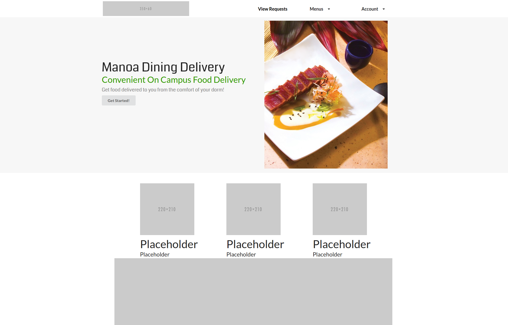
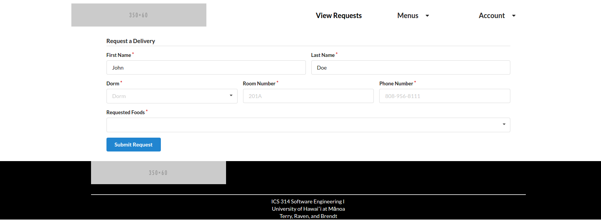
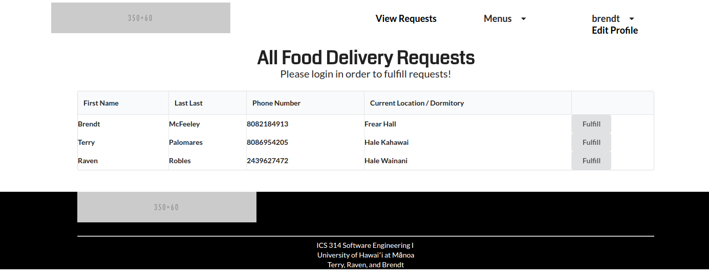
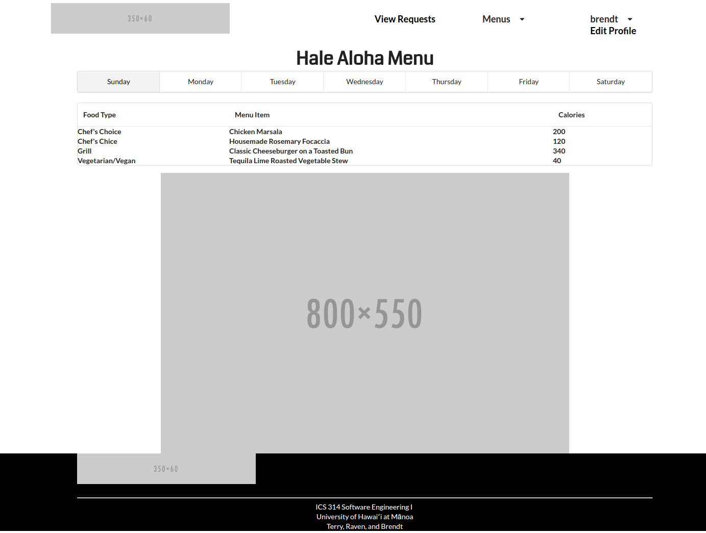
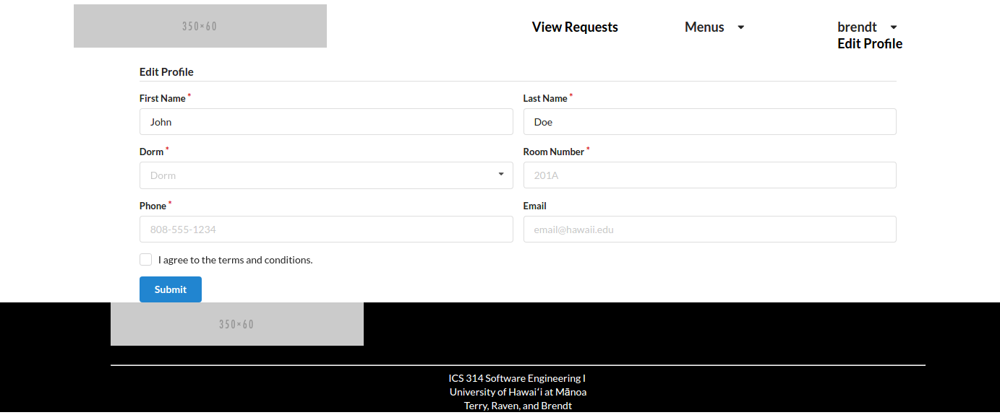

Milestone 1 was implemented as [Manoa Dining Delivery GitHub Milestone M1](https://github.com/innovation-manoa/manoa-dining-delivery/milestone/2)::

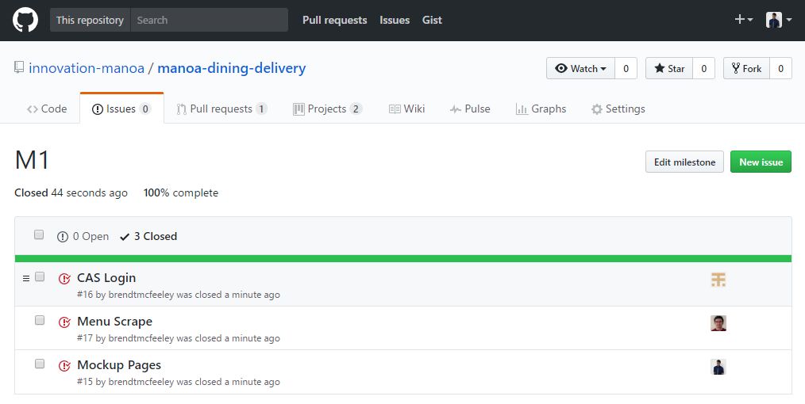

Milestone 1 consisted of three issues, and progress was managed via the [Manoa Dining Delivery GitHub Project M1](https://github.com/innovation-manoa/manoa-dining-delivery/projects/1):

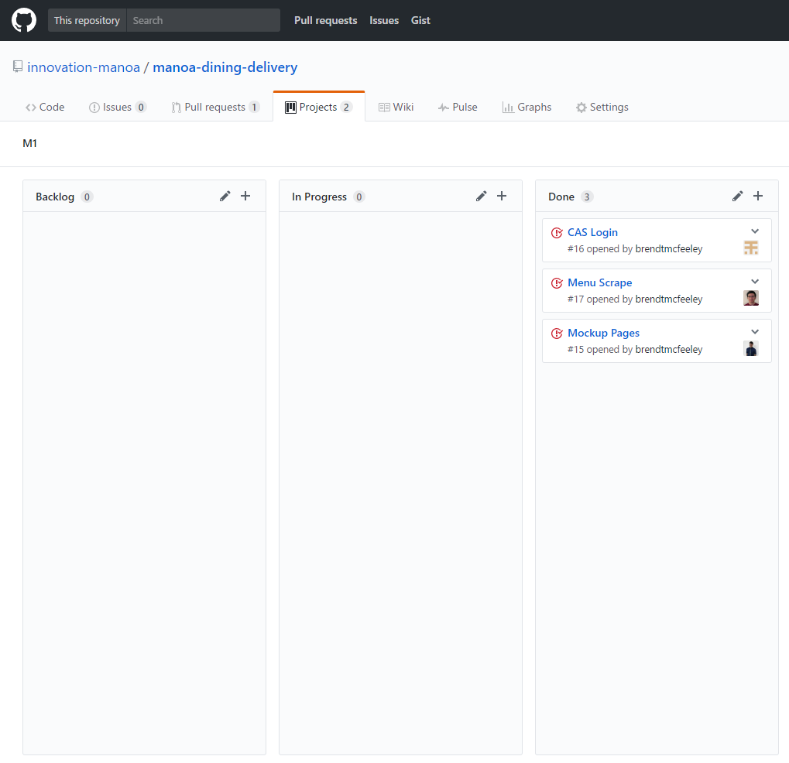

Each issue was implemented in its own branch, and merged into master when completed:

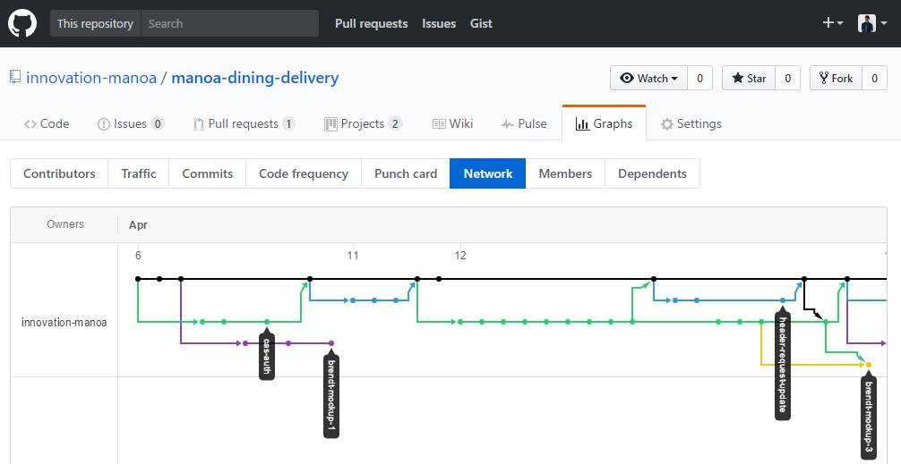

## Milestone 2: Collections, Design, and Menu Automation

Milestone 2 started on April 13, 2017 and ended on April 27, 2017. The goals
for Milestone 2 are managed [here](https://github.com/innovation-manoa/manoa-dining-delivery/projects/2).

The goal of the second milestone is to create various Mongo Collections for the
different features of the application, and to improve the overall design of the
application. Currently we have to manually run python script to scrape menu data,
but we would like to find a way to automate this weekly.

The creation of the various collections will allow the different features of the
application to function, such as creating requests, displaying requests, and
displaying current items on the menu.

Milestone 2 was implemented as [Manoa Dining Delivery GitHub Milestone M2](https://github.com/innovation-manoa/manoa-dining-delivery/milestone/1)::


Milestone 2 consisted of five issues, and progress was managed via the [Manoa Dining Delivery GitHub Project M2](https://github.com/innovation-manoa/manoa-dining-delivery/projects/2):


Each issue was implemented in its own branch, and merged into master when completed:


## Milestone 3: Connecting UI to backend

Milestone 3 will start on April 28, 2017 and will end on May 9, 2017.

The goal is Milestone 3 was to connect all of our frontend features to the backend. We updated the templates used on each page with form control templates from meteor-example-form. We also wanted to improve the UI of our application in Milestone 3. This meant implementing SweetAlert into our application and replacing the edit profile page. We decided a profile wasn't a big priority for a food delivery application and having a nice UI friendly SWAL form would be optimal. We also redid some of the design of the header for a more visually appealing web application.

The goal of Milestone 3 was to connect the user interface to the underlying data model. This meant that we updated the templates for each page with calls to helper functions, and we created Javascript files for the templates with helper functions. We used the form control templates from meteor-example-form to simplify implementation of form processing.

The goals for Milestone 3 are managed [here](https://github.com/innovation-manoa/manoa-dining-delivery/projects/3).

Milestone 3 was implemented as [Manoa Dining Delivery GitHub Milestone M3](https://github.com/innovation-manoa/manoa-dining-delivery/milestone/3)::


Milestone 3 consisted of seven issues, and progress was managed via the [Manoa Dining Delivery GitHub Project M3](https://github.com/innovation-manoa/manoa-dining-delivery/projects/3):


Each issue was implemented in its own branch, and merged into master when completed:


## Initial User Study

To test our web application, we asked various members of the Univert of Hawaii community to test our application. We explained what the premise of the website is and let them test it out. These are the following responses :

Makamae Carpenter (Junior, Electrical Engineering) :

The application isn't responsive enough in a mobile platform. I think a good majority of college students would be on their phones when deciding to use this service. A ggood responsive mobile platform would make the app very solid. I like the design because it's very simple. An app that is simple to figure out is a good app in my opinion.

Christian Shimabuku (Senior, Journalism) :

When you first come to the site it is very visually pleasing because it's simple. The front page doesn't seem to have many features but I don't think that's the purpose of it. A clear pricing scale would be nice to have so users would know how much to pay everytime.

Brandon Rivera (Junior, Journalism) :

It's a great idea for students who do not feel like getting up and walking down. I feel like it's also a really great idea to make sure students always use their meal swipes. This idea is great and benefits both parties involved.

Irene Ma (Junior, Animal Science) :

The website looks very professional. I wish the website would give you some kind of alert or email when someone fulfills your request. Getting a random phone call may seem unsettling when you don't expect. I feel like the menus could also use some sort of work with more color added to it to make it more appealing.

Christopher Afuso (Sophmore, Botany) :

This definitely looks like something I could see myself using. The UI is very simple and isn't cluttered. The website clearly has a purpose and it fulfills it. The links all pertain to the object of the website which is to have food delivered to your dorm. Maybe the one thing I wish the site had was some kind of estimater of how much food you could fit into the container. Maybe measaurements of the takeout box too. A student can request a lot of food that obviously would not fit into the box and the person retrieving the food would not know what to do.
