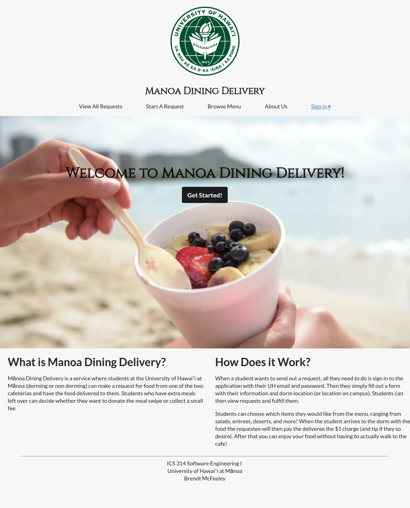
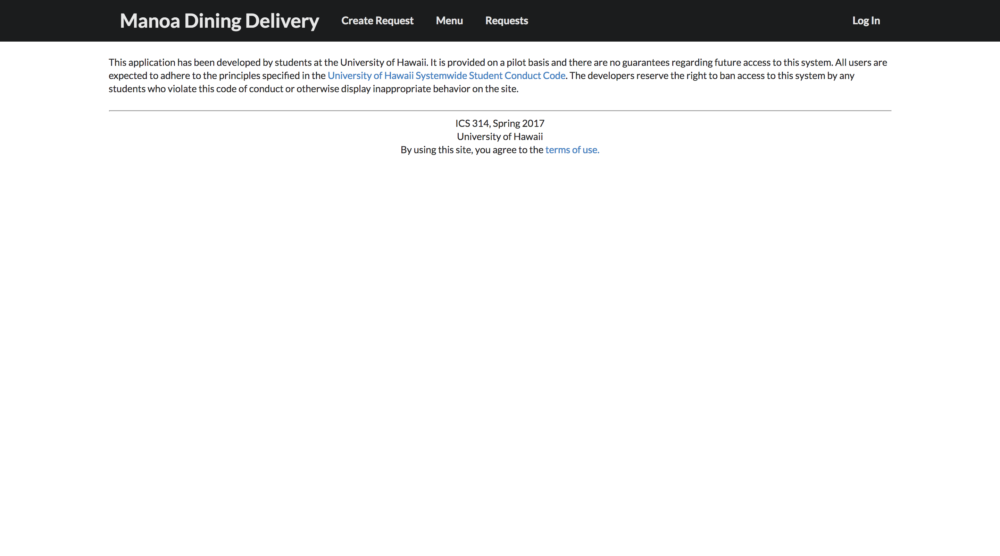
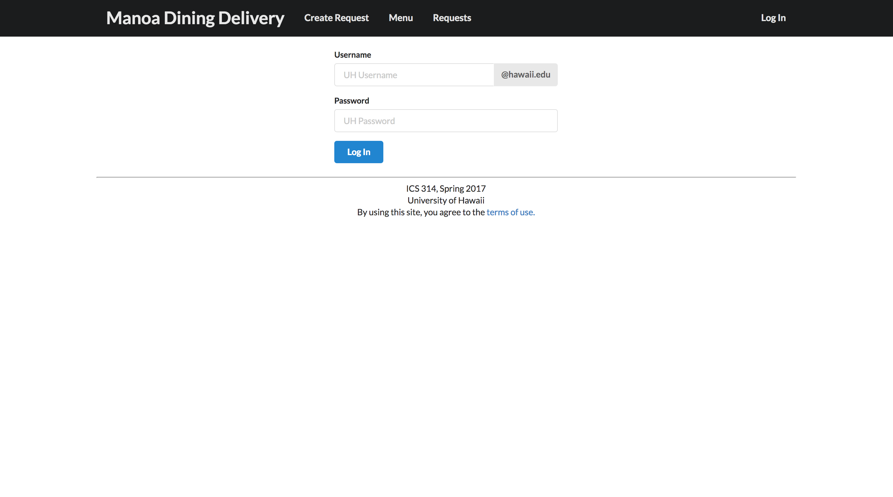
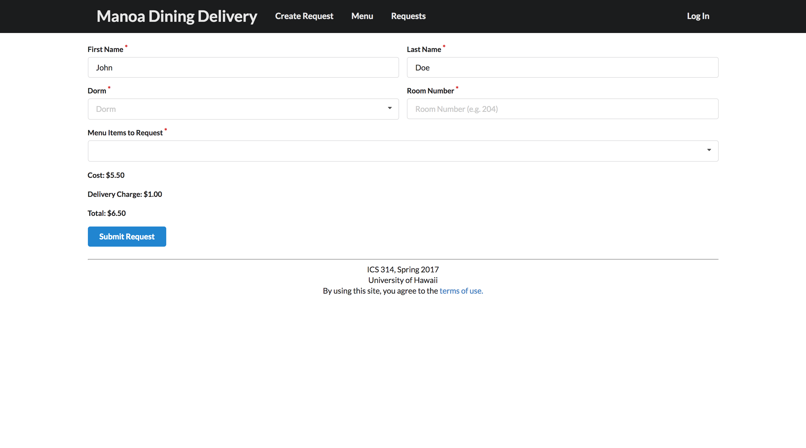
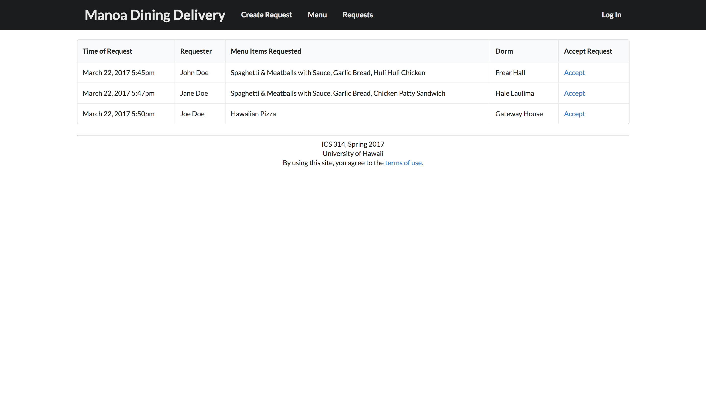
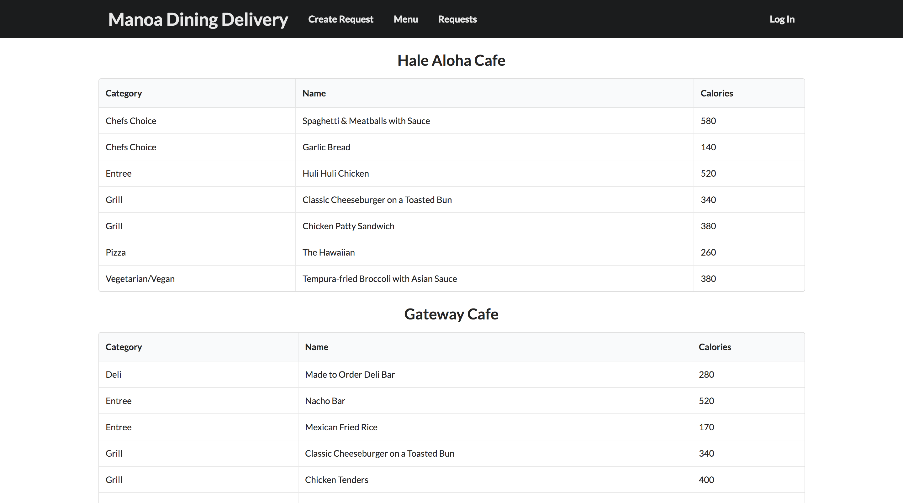

# Table of Contents

* [About Manoa Dining Delivery](#about-manoa-dining-delivery)
  * [Background](#background)
  * [Problem](#problem)
  * [Solution](#solution)
* [Installation Guide](#installation-guide)
* [Development History](#development-history)
  * [Milestone 1: Mockup Development](#milestone-1-mockup-development)
    * [Landing Page](#landing-page)
    * [Terms of Use Page](#terms-of-use-page)
    * [Log In Page](#log-in-page)
    * [Create Request Page](#create-request-page)
    * [Requests Page](#requests-page)
    * [Menu Page](#menu-page)
  * [Milestone 2: Integration of Forms with Databases](#milestone-2-integration-of-forms-with-databases)

# About Manoa Dining Delivery

## Background

Meal plans at the University of Hawaii at Manoa come in either 7, 10, 14 or 19
meals a week along with  "meal points", which are essentially cash credits put 
in your account (1 point = $1) that are reloaded once a semester. For students
living at the dormitories, it is mandatory to have a meal plan.

## Problem

Meals do not rollover to the next week if you do not spend them all. Meal
points, however, do rollover to the next semester if you do not spend it all.
By the end of each week, many people have tons of meals left over and are forced
to spend their meals at The Market, an on-campus convenience store, on food they
don't really want. If given the opportunity, many of those people would exchange
their meals for cash.

In addition, many people who are busy studying (or being lazy) would rather have
food delivered to them rather than going all the way to the cafeteria to get
food. If given the opportunity to get food delivered to them for a small amount,
some students would do so.

## Solution

Manoa Dining Delivery is a Meteor application that allows University of Hawaii
at Manoa students to create requests to have food delivered right to their
dorms. The foods come from the two cafeterias on campus: Hale Aloha Café and
Gateway Café. Students living at the dorms will be able to spend their meals
in exchange for cash.

# Installation Guide

First, [install Meteor](https://www.meteor.com/install).

Second, clone the repo using the following on the command line:

```
$ git clone https://github.com/innovation-manoa/manoa-dining-delivery.git
```

Alternatively, you can [download](https://github.com/innovation-manoa/manoa-dining-delivery/archive/master.zip)
the application

Third, cd into the app/ directory and install required packages using:

```
$ meteor npm install
```

Fourth, run the system with:

```
$ meteor npm run start
```

# Development History

## Milestone 1: Mockup Development

The first milestone for this application is focused on implementing a mockup
of the pages. The following mockup pages developed earlier are used as a basline
for developing the application.

### Landing Page

Upon entering the site, the user is directed to the landing page.



### Terms of Use Page

In order to use the application, users must agree to the terms of use, displayed
on the following page.



### Log In Page

This page is used to allow users to login and use the application. Eventually,
this will be change to utilize the UH CAS authentication system rather than this
to allow users to log in.



### Create Request Page

Users can create a request to have food delivered to their dorm using the
following form. It requires the user enter their dorm, room number, and the
foods they want delivered.



### Requests Page

All requests that are made are displayed on the following page. Other users
can choose to accept the request and fulfill it.



### Menu Page

The current foods on the menu at both cafeterias will be displayed on this page.
A script will be used to retrieve them.



## Milestone 2: Integration of Forms with Databases

The second milestone for this application will focus on integrating the various
forms of the page with a database using MongoDB.
