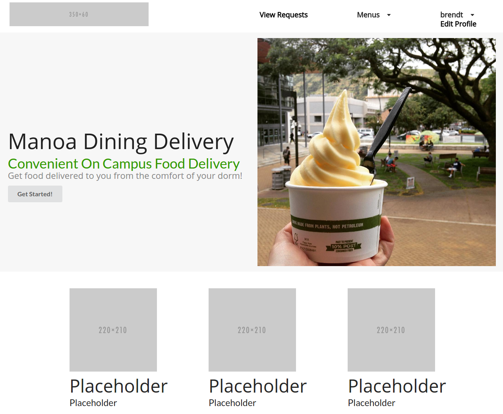
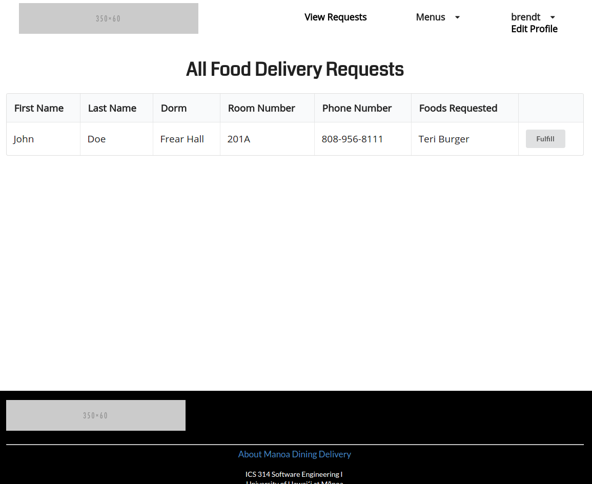
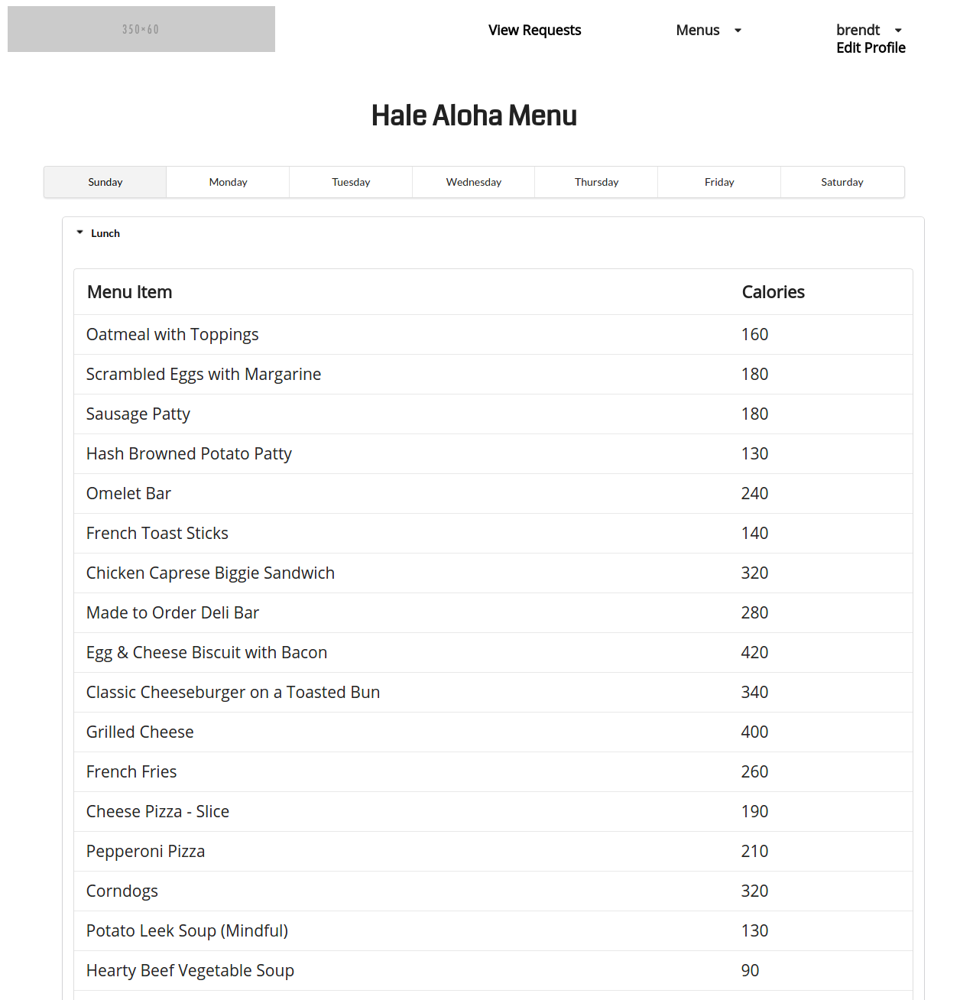

# Table of Contents

* [About Manoa Dining Delivery](#about-manoa-dining-delivery)
  * [Background](#background)
  * [Problem](#problem)
  * [Solution](#solution)
* [Installation Guide](#installation-guide)
* [Development History](#development-history)
  * [Milestone 1: Mockup Development](#milestone-1-mockup-development)
  * [Milestone 2: Collections and Design](#milestone-2-collections-and-design)

The application can be found [here](http://manoa-dining-delivery.meteorapp.com/).

# About Manoa Dining Delivery

When you come to the site, you are greeted by the following landing page:


Anyone with a UH account can login to Manoa Dining Delivery by clicking on the login button. The UH CAS authentication screen then appears and requests your UH account and password. Upon logging in you are able to create a food delivery request and view all food delivery requests:



Users can also edit their information on the edit profile page:


Before making an order users can view the menu of both Hale Aloha and Gateway Cafe. The menus are read from a JSON file scripted by Python. They display the catergory of food the food is from and the caloric value:


## Background

Meal plans at the University of Hawaii at Manoa come in either 7, 10, 14 or 19
meals a week along with  "meal points", which are essentially cash credits put 
in your account (1 point = $1) that are reloaded once a semester. For students
living at the dormitories, it is mandatory to have a meal plan.

## Problem

Meals do not rollover to the next week if you do not spend them all. Meal
points, however, do rollover to the next semester if you do not spend it all.
By the end of each week, many people have tons of meals left over and are forced
to spend their meals at The Market, an on-campus convenience store, on food they
don't really want. If given the opportunity, many of those people would exchange
their meals for cash.

In addition, many people who are busy studying (or being lazy) would rather have
food delivered to them rather than going all the way to the cafeteria to get
food. If given the opportunity to get food delivered to them for a small amount,
some students would do so.


## Solution

Manoa Dining Delivery is a Meteor application that allows University of Hawaii
at Manoa students to create requests to have food delivered right to their
dorms. The foods come from the two cafeterias on campus: Hale Aloha Café and
Gateway Café. Students living at the dorms will be able to spend their meals
in exchange for cash.

# Installation Guide

First, [install Meteor](https://www.meteor.com/install).

Second, clone the application by invoking the following command 
on the terminal.

```
$ git clone https://github.com/innovation-manoa/manoa-dining-delivery.git
```

Alternatively, you can download it by clicking [here](https://github.com/innovation-manoa/manoa-dining-delivery/archive/master.zip).

Third, cd into the app/ directory and install required packages using:

```
$ meteor npm install
```

Fourth, run the system with:

```
$ meteor npm run start
```

When the application is successfully built, it will appear on [http://localhost:3000/](http://localhost:3000/).

# Development History

## Milestone 1: Mockup Development

Milestone 1 started on April 6, 2017 and ended on April 13, 2017. The goals for 
Milestone 1 are managed [here](https://github.com/innovation-manoa/manoa-dining-delivery/projects/1).

The goal of the first milestone was to create mockups of the various pages of 
the application, create a script that would scrape the menu items from both Hale 
Aloha Café and Gateway Café, and to utilize the University of Hawaii CAS
authentication. All placeholder images and text in the following mockup
screenshots will be replaced in Milestone 2.

Mockups for the following four pages were implemented during M1:


Milestone 1 was implemented as [Manoa Dining Delivery GitHub Milestone M1](https://github.com/innovation-manoa/manoa-dining-delivery/milestone/2)::


Milestone 1 consisted of three issues, and progress was managed via the [Manoa Dining Delivery GitHub Project M1](https://github.com/innovation-manoa/manoa-dining-delivery/projects/1):


Each issue was implemented in its own branch, and merged into master when completed:


## Milestone 2: Collections, Design, and Menu Automation

Milestone 2 started on April 13, 2017 and will end on April 25, 2017. The goals
for Milestone 2 are managed [here](https://github.com/innovation-manoa/manoa-dining-delivery/projects/2).

The goal of the second milestone is to create various Mongo Collections for the
different features of the application, and to improve the overall design of the
application. Currently we have to manually run python script to scrape menu data,
but we would like to find a way to automate this weekly.

The creation of the various collections will allow the different features of the
application to function, such as creating requests, displaying requests, and
displaying current items on the menu.

Milestone 2 was implemented as [Manoa Dining Delivery GitHub Milestone M2](https://github.com/innovation-manoa/manoa-dining-delivery/milestone/1)::


Milestone 2 consisted of five issues, and progress was managed via the [Manoa Dining Delivery GitHub Project M2](https://github.com/innovation-manoa/manoa-dining-delivery/projects/2):


Each issue was implemented in its own branch, and merged into master when completed:


